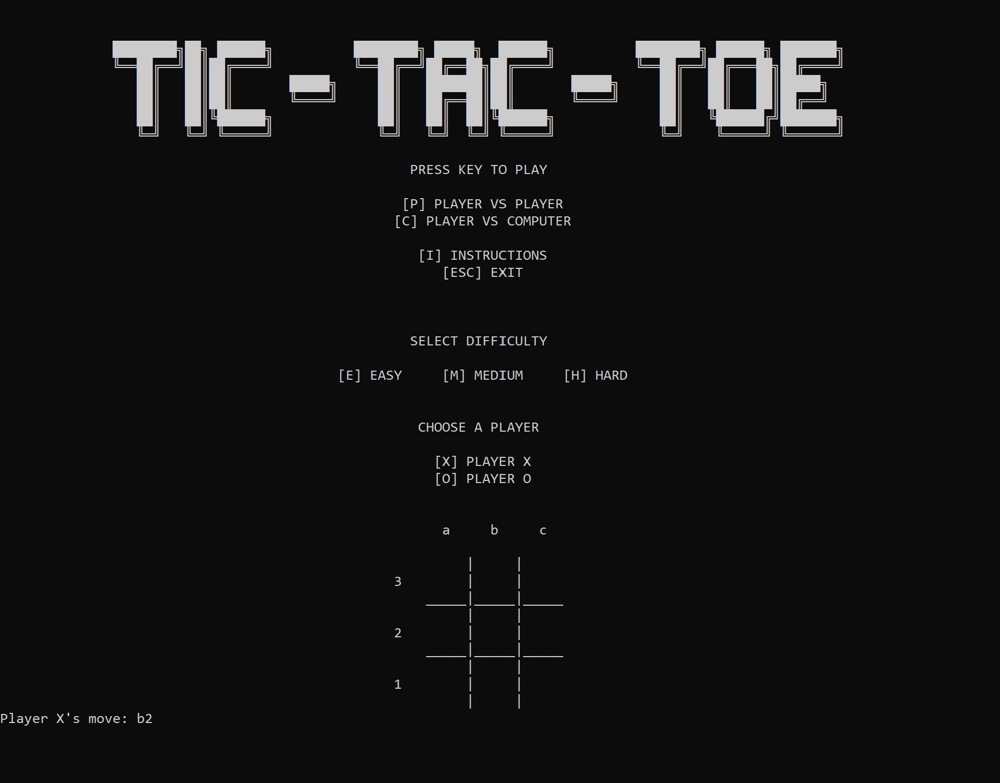

# Wow, Another Tic Tac Toe Game!

This is a text-based tic-tac-toe game I made for my computer science course in Grade 10. This was quite a fun one! Once I figured out the player-versus-computer mode I was absolutely ecstatic :D

The final project entailed creating a game or an animated scene with Python. One of the options was to create a text-based classic game, such as Hangman or Tic Tac Toe.

## What it does

The game allows two players to play against each other or lets one play against the computer (if they're lonely).

There are three levels of difficulty to the player-versus-computer mode:
- Easy
- Medium
- Hard (actually impossible, but you want to give people that sliver of hope!)

These levels of difficulty were different in that the algorithm could not look as far ahead in the game tree.

